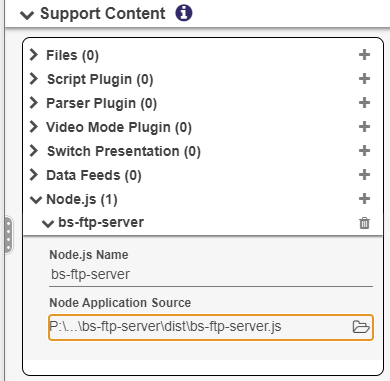

# BS-FTP-SERVER

## Overview

This is a drop-in Node.js module that creates an FTP server on a BrightSign player. The FTP server can be reached via the players IP address on port 21, anonymously (no credentials)

## Limitations

Currently set to use the IP address from the ethernet connection of the player. There are no user/password credentials configured - this sets up anonymous access.

## Installation

In BrightAuthor:connected, add the bs-ftp-server.js from the DIST folder to the Presentation as a Node.js Support Content item.

